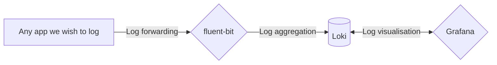

# Deployment: Eleutheria

> How do we deploy?

It is plan to make use of OpenTofu with Hetzner Cloud servers for provisioning.

> Can not upgrade from versions older than 1.35, please upgrade to that version or later first.

Do not start the container for the first time "as-is". A setup process is required by MediaWiki.

Instead, go to your Compose file, and set the following environment variable: `ELEUTHERIA_PREPARE_DB`. Any value accepted.

Start up the application, you should see that LocalSettings.php has been deleted in logs. Go then to the web application at set port, and complete the setup process.
Once the database migrations have been ran, stop the application, and remove `ELEUTHERIA_PREPARE_DB`, and launch it again.

This procedure make it more easier to set up your Wiki.

## Logging

We use a mix of different systems for logging, composed of the following components

